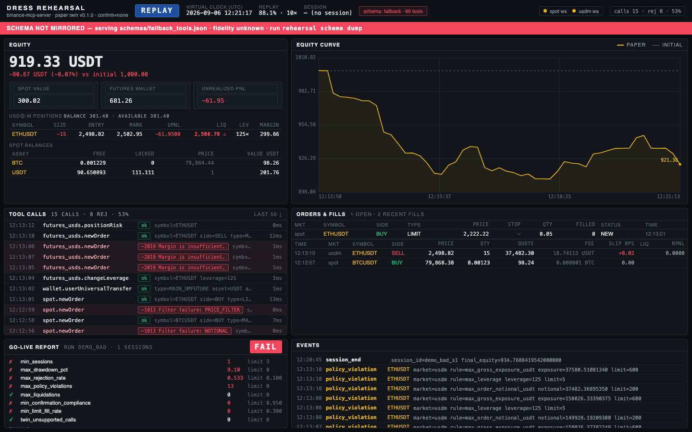
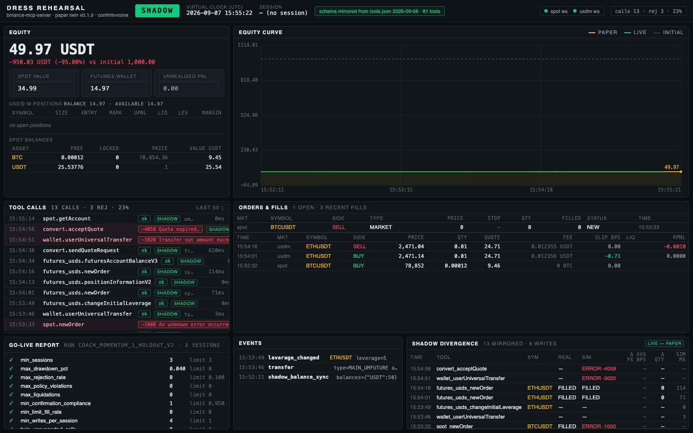

# Dress Rehearsal

**Before you give your trading agent capital, give it a dress rehearsal. Find the mistakes, understand
the failures, and retest the correction.**

> Same agent. Same prompt. Change one URL.

Dress Rehearsal is a **Rehearsal Agent for Binance Agent OS**, shipped as an installable Skill Hub skill,
that takes any trading agent from prompt to production: it rehearses the agent on a zero-drift paper twin
of the Binance MCP server, explains what went wrong, fixes the strategy, verifies the fix on unseen market
data, gates go-live, and shadows the agent once it trades for real.

| Binance Agent OS Mini Hackathon | |
|---|---|
| Track A · Build an AI agent with Agent OS | The Rehearsal Agent (`rehearsal coach`) + the Skill Hub skill in [`skills/dress-rehearsal/`](skills/dress-rehearsal/SKILL.md) |
| Track B · Connect your MCPs and trade live | 8 live writes (spot, futures, convert, transfers) through the flip with shadow mode on: [evidence](#track-b-evidence-the-flip-for-real) |
| Video | _coming with the submission_ |
| Evidence bundle | [`evidence/coach_momentum_1/`](evidence/coach_momentum_1/): a real FAIL → diagnosis → fix → PASS on a held-out window, with transcripts |



Dress Rehearsal is two things. A **paper twin** of the Binance Agent OS MCP server: the same 81 tools,
the same hidden catalog, the same error envelope, mirrored from the live endpoint with zero drift, backed
by the real order book and a simulated ledger. And a **Rehearsal Agent** that runs your strategy against
the twin headlessly, explains the failure with the exact tool responses, rewrites only the strategy,
retests it, and verifies the fix on a recorded market window it never saw. Pass, and you flip one URL;
shadow mode then mirrors every live call back into the twin so you can see how wrong the paper fill was.

## Why

Binance Agent OS hands an agent a **live**, funded sub-account behind `https://agent.binance.com/mcp/agentic`.
Binance does run Spot and Futures testnets, but they are separate REST APIs with separate keys: the MCP
endpoint your agent actually uses has no paper mode, and the testnets do not speak its tools. So the
first time an agent sends a quantity rounded to the wrong step, oversizes an order, or forgets its open
take-profit, it does so with real money. And even with a sandbox, a builder still needs the second half:
a repeatable evaluation, a report that says *why* it failed, and proof that the correction holds on data
the correction was not tuned on.

That is what Dress Rehearsal adds on top of the twin: repeatable agent evaluations, actionable failure
reports, a bounded correction loop, and live-versus-paper comparison after the flip.

## Quickstart

```bash
git clone https://github.com/bilgin-kocak/dress-rehearsal && cd dress-rehearsal
python3 -m venv .venv && .venv/bin/pip install -e ".[dev]"    # 1. install (Python ≥ 3.11)
cp rehearsal.example.yaml rehearsal.yaml
.venv/bin/rehearsal schema dump                                # 2. mirror the real tools/list (after one OAuth in Claude Code)
.venv/bin/rehearsal serve --transport http                     # 3. twin on http://127.0.0.1:8765/mcp, dashboard on :8765/
claude mcp add binance-mcp-server --transport http http://127.0.0.1:8765/mcp     # 4. point your agent at the twin
.venv/bin/rehearsal run --strategy prompts/strategy_simple_momentum.md --sessions 3   # 5. rehearse → report → gate
```

No Binance account is needed for steps 3-5 (public market data only). Three ways in, from easiest:

```bash
.venv/bin/rehearsal doctor                                   # environment check + the next command
./scripts/demo.sh                                            # 2-minute dashboard walkthrough (scripted tool calls, labelled as such)
.venv/bin/rehearsal coach --strategy prompts/strategy_momentum_v1.md   # the real thing: fail → diagnose → fix → verify (≈ $6 of LLM, 25 min)
.venv/bin/rehearsal coach --strategy my_strategy.md          # bring your own strategy prompt
```

Your strategy prompt is plain Markdown addressed to the agent, using the real tool names
(`spot.newOrder`, `spot.exchangeInfo`, `futures_usds.newOrder`, ...). See `prompts/` for three examples.

## How it works

```
                       ┌──────────────────────────────────────────────┐
                       │  Agent client (Claude Code / Codex / Cursor) │
                       └──────────────┬───────────────────────────────┘
                                      │ MCP (stdio or streamable HTTP)
                      paper           │            live
             ┌────────────────────────┴───────────────────────────┐
             ▼                                                    ▼
   ┌──────────────────────┐                        ┌──────────────────────────┐
   │  TWIN MCP SERVER     │                        │  Binance Agentic MCP     │
   │  (this repo)         │◄── shadow events ──────│  agent.binance.com       │
   │  tools mirrored from │   (Claude Code hook)   └──────────────────────────┘
   │  schemas/tools.json  │
   └──────────┬───────────┘
              │
   ┌──────────┴───────────┐     ┌───────────────────┐     ┌─────────────────────┐
   │  Fill Engine         │◄────│  Market Data Feed │◄────│ Binance public REST │
   │  (spot / usdm)       │     │  (REST + WS)      │     │ + WebSocket streams │
   └──────────┬───────────┘     └───────────────────┘     └─────────────────────┘
              │
   ┌──────────┴───────────┐     ┌───────────────────┐     ┌─────────────────────┐
   │  Ledger (SQLite)     │────►│  Report / Gate    │────►│ Dashboard (HTML)    │
   └──────────────────────┘     └───────────────────┘     └─────────────────────┘
```

One Python package, one process, one SQLite file. Details in [ARCHITECTURE.md](ARCHITECTURE.md).

### Rehearsal

`rehearsal run` starts the twin, launches your agent headless (`claude -p … --mcp-config …`) N times
with the strategy prompt, resets the paper ledger between sessions, and tags every tool call with the
session. Replay mode (`--mode replay --fixture fixtures/replay/demo`) drives everything from a recorded
book with a virtual clock, so results are reproducible; live mode uses the public order book in real
time with paper money.

Orders are validated exactly like Binance (`PRICE_FILTER`, `LOT_SIZE`, `NOTIONAL`, precision) and
rejected with the **real error codes** — `{"code": -1013, "msg": "Filter failure: LOT_SIZE"}` — because a
rejection is the product: it is how you catch the hallucinated parameter before it costs money. Market
orders walk the real depth; limit orders rest and fill when the trade stream prints through their price;
futures run isolated margin with mark-price PnL, funding and liquidation.

### Report

`reports/<run_id>/report.md` (+ `.json`): P&L, max drawdown, slippage vs mid at decision time, limit
fill rate, rejections by code and symbol, retry loops, policy violations, liquidations, confirmation
compliance (did the agent restate symbol/side/qty before every write?), whether it flattened and
cancelled stale orders — and rule-based recommendations such as
*"3 precision rejections on BTCUSDT (-1111) — too many decimals in quantity; format numbers to the asset precision."*

### Gate

`rehearsal gate` evaluates the thresholds in `rehearsal.yaml` (sessions, drawdown, rejection rate,
policy violations, liquidations, confirmation compliance, limit fill rate) and exits 0/1:

```
✔ GO-LIVE GATE PASSED (3/3 sessions)  run=run_20260907_101500
Flip to live:
  claude mcp remove binance-mcp-server
  claude mcp add binance-mcp-server --transport http https://agent.binance.com/mcp/agentic
  rehearsal shadow install   # keeps the twin mirroring your live calls
```

A PASS writes `reports/GATE_PASS.json` with a 24 h TTL; the bundled skill refuses live orders without a
fresh one.

### Flip

The strategy prompt does not change. The tool names do not change. Only the MCP URL does.

### Shadow

`rehearsal shadow install` adds a Claude Code `PostToolUse` hook for `mcp__binance-mcp-server__.*`.
Every live call is POSTed to the twin, which re-executes it on the paper ledger (reads are recorded,
writes simulated) and computes the divergence per order: real vs simulated status, average price
difference in bps, executed quantity, latency. The dashboard overlays the live and paper equity curves
and prints a **twin calibration** suggestion (`engine.latency.mean_ms`, `engine.queue_factor`).

## Dashboard

`http://127.0.0.1:8765/` — mode badge (PAPER / SHADOW / REPLAY), virtual clock, schema-mirror status
(red banner if the twin is on the fallback schema), balances and positions with liquidation price,
equity curve, open orders, last fills with slippage, the tool-call stream with rejections highlighted,
the latest gate result with a "copy flip command" button, and the shadow divergence table.

## What is enforced by code, what is measured, what depends on the agent

| Control | How it works | Enforced by |
|---|---|---|
| Exchange filters (LOT_SIZE, PRICE_FILTER, NOTIONAL, precision) | Validated exactly like Binance; rejected with the real code and message | twin code, always |
| Insufficient balance / margin, LIMIT_MAKER would take, stop would trigger | Rejected before the order exists | twin code, always |
| Policy limits (allowlist, max notional, gross exposure, leverage, orders/min) | Counted into the report; blocks the order only with `policy.enforce: true` | measured by default, code when enforced |
| Go-live gate | Thresholds in `rehearsal.yaml`; exit code 0/1; `GATE_PASS.json` with a 24 h TTL | code |
| A session that never trades cannot pass | `min_writes_per_session` criterion | code |
| Confirmation compliance | Share of writes restated (symbol, side, qty) in the assistant turn before the call, from the transcript | measured, not enforced |
| The Rehearsal Agent may only change the strategy | No file or MCP tools in the coach step; threshold fingerprint before/after; proposals mentioning thresholds are refused | code |
| "Never trade live without a fresh PASS" | Rule in `skills/dress-rehearsal/SKILL.md` | depends on the agent following the skill |
| Shadow mirroring | Claude Code `PostToolUse` hook; never blocks or alters the live call | code (hook), only for Claude Code |

A PASS means "passed these operational checks, on these recorded windows, with this schema". It is not a
profit forecast, and it does not claim matching-engine fidelity.

## Fidelity: what is simulated, what is not

| Simulated | Not simulated |
|---|---|
| Tool names + inputSchemas mirrored verbatim from the real `tools/list` and hidden catalog (`rehearsal schema validate --live-url` proves zero drift); JSON-RPC error envelope; `initialize` instructions and resources | Gateway/OAuth latency of the hosted MCP |
| Binance filter validation and error codes, no auto-rounding | Matching-engine priority, self-trade prevention |
| Taker fills against the live/recorded book at `t + latency` (configurable N(80, 30) ms or fixed) | Market impact of your own orders |
| Resting limit fills via traded-volume queue approximation (`queue_factor`, calibrated by shadow mode) | OCO, trailing stops, iceberg |
| Spot stops, IOC/FOK/LIMIT_MAKER, commission in the received asset; COIN-M public market data passes through | Margin trading, COIN-M trading, options, OCO/OTO order lists, AI token reports (`TWIN_UNSUPPORTED`, counted in the report) |
| USDⓈ-M cross (default, 20x like a fresh sub-account) and isolated margin: leverage, mark-price uPnL, liquidation, funding at 00/08/16 UTC | ADL, insurance-fund details, hedge mode |
| Internal transfers (spot ↔ futures), Convert quotes against the book | Withdrawals (do not exist on the real server either) |

The twin certifies operational safety (valid parameters, respected limits, no blow-ups, confirmed
writes). It is not a profit forecast.

## Schema mirroring: zero drift

Binance only accepts OAuth from listed clients, so the twin reuses the token Claude Code stores after
you authenticate once (`/mcp` → `binance-mcp-server` → Authenticate). `rehearsal schema dump` then
fetches the real `tools/list` (paginated, 81 always-exposed tools), walks `tool_search` across every
category to mirror the **316-tool hidden catalog** reachable through `tool_execute`, copies the server's
`initialize` payload (name, instructions) and its workflow resource, and captures read-only samples plus
one rejected write on symbol `FOOBAR` so the exact error envelope is known.

```
$ rehearsal schema validate --live-url https://agent.binance.com/mcp/agentic
twin serves 81 tools from schemas/tools.json (source=mirrored)
tools.json vs twin: identical=True (common 81, mismatches [])
LIVE https://agent.binance.com/mcp/agentic vs twin: ZERO DRIFT ✔ — common 81, only live [], only twin [], schema mismatches []
hidden catalog: 237 tools reachable via tool_execute; 71 simulated, 166 return TWIN_UNSUPPORTED
```

What the wire showed, and what the twin copies (details in [schemas/CONFIRMATION.md](schemas/CONFIRMATION.md)):

- Rejections are **JSON-RPC errors** whose message is the raw Binance JSON
  (`{"code":-1013,"msg":"Filter failure: LOT_SIZE"}`), not `isError` results. The twin does the same.
- A fresh Agentic sub-account is **cross margin at 20x** on every symbol. The twin starts there too, and
  liquidates the whole cross wallet the way Binance would.
- Confirmation is instruction-based (restate, wait for yes); there is no elicitation or confirm token.

Without a dump the twin serves `schemas/fallback_tools.json` and shows a red **SCHEMA NOT MIRRORED**
banner. See [scripts/dump_tools.md](scripts/dump_tools.md).

## Skill Hub skill

[`skills/dress-rehearsal/SKILL.md`](skills/dress-rehearsal/SKILL.md) is the Rehearsal Agent contract in
Binance Skill Hub format: never trade live without a fresh gate PASS, validate the schema first, run the
rehearsal, summarise the report, show the flip, install shadow mode, restate every write, never
suggest disabling the gate.

## CLI

```
rehearsal serve   [--transport stdio|http] [--port 8765] [--mode live|replay] [--fixture PATH] [--speed X]
rehearsal schema  dump | validate [--live-url URL] | dump-instructions
rehearsal record  --symbols BTCUSDT,ETHUSDT --minutes 60 --out fixtures/replay/<name>
rehearsal run     --strategy PATH --sessions N --client claude-code|codex|manual [--mode live|replay] [--fixture PATH]
rehearsal report  [--run-id ID] [--format md|json]
rehearsal gate    [--run-id ID]
rehearsal shadow  install | uninstall | status
rehearsal reset
rehearsal demo    [--speed 10]
```

Tests (no network): `.venv/bin/pip install -e ".[dev]" && .venv/bin/pytest` (68 tests, also run in CI).

## The Rehearsal Agent

```
rehearsal coach --strategy prompts/strategy_momentum_v1.md
```

One command runs the loop a careful builder would run by hand:

1. **Rehearse** the strategy for three headless Claude Code sessions on the *dev* replay window.
2. On FAIL, **diagnose**: the agent reads the report and the exact tool responses the trading agent
   received (`{"code":-1013,"msg":"Filter failure: LOT_SIZE"}`, the policy violation, the order left open)
   and names each root cause in the strategy text.
3. **Propose a bounded correction**: it rewrites only the strategy prompt, saved as `<strategy>.v2.md`
   with a unified diff. It has no file tools and no MCP access; the gate thresholds and policy limits are
   fingerprinted before and after the loop and reported. A proposal that mentions changing them is refused.
4. **Retest** v2 on the dev window.
5. **Verify on a held-out window** recorded two hours later, with the same thresholds. That is the verdict.

The result is `reports/<coach_id>/COACH.md`: a timeline table, the diagnosis in plain words with evidence,
the corrections, every strategy version with its hash, and the reproduction command. A curated copy of a
real run lives in [`evidence/`](evidence/).

A real run of the loop on `prompts/strategy_momentum_v1.md` (a plausible first draft: hard-coded rounding
to six decimals, "70% of the balance" sizing, a take-profit left open at the end), three headless Claude Code
sessions per step, coach model Opus, trading sessions on Sonnet:

| step | window | gate | rejected | policy violations | writes restated | max drawdown | flat at end |
|---|---|---|---|---|---|---|---|
| v1 on dev window | `demo` | **FAIL** | 3 (11.1%) | 12 | 100% | 0.11% | 0/3 |
| v2 on dev window | `demo` | **PASS** | 0 (0.0%) | 0 | 100% | 0.05% | 3/3 |
| v2 on HELD-OUT window | `holdout` | **PASS** | 0 (0.0%) | 0 | 100% | 0.04% | 3/3 |

The agent's diagnosis, verbatim from `COACH.md`:

> The strategy didn't fail on market direction — it failed on arithmetic it never did. It sizes from "70% of free USDT" (700 on a 1000 USDT book) with no reference to the 200-per-order / 600-gross budget, so every single order was a policy violation, twice over once the resting take-profit stacked on top of the spot holding. And it hardcodes "6 decimal places" for quantity instead of reading LOT_SIZE stepSize, so ETHUSDT (step 0.00010000) rejected -1013 every session, pushing the rejection rate to 11.1%. P&L was flat to slightly negative; the gate never got that far.

It then proposed 13 corrections to the strategy text only (read `spot.exchangeInfo` as the sole
source of truth, floor to `stepSize`/`tickSize`, size to 180 USDT so both legs stay inside the 200/600 limits,
sell from the post-fee base balance, cancel and flatten before finishing). Gate/policy fingerprint before and after:
`fc9e174a06af909e` (unchanged). Total LLM cost: $4.98.
The full bundle, including transcripts, is in [`evidence/coach_momentum_1/`](evidence/coach_momentum_1/).

What the rehearsal caught before it could cost anything: in each of three sessions v1 tried to send a
700 USDT order against a 200 USDT mandate (3.5× the limit), stacked a same-size take-profit on top of it,
was rejected once for a mis-rounded quantity, and finished with a live position and a resting order.
On a funded account that is three oversized fills and three unattended orders. v2 did none of it.

## Single rehearsals (`rehearsal run`)

`prompts/strategy_deliberately_bad.md` (a plausible but flawed scalper: hard-coded sizes, 20x, "retry the
identical call"), one headless Claude Code session against the replay twin serving the **mirrored** schema:

```
✘ GO-LIVE GATE FAILED (1 sessions)  run=mirrored_bad_1
  - max_rejection_rate: 0.167 (limit <= 0.1)
  - max_policy_violations: 4 (limit <= 0)
  - min_confirmation_compliance: 0.571 (limit >= 0.95)
Top recommendations:
  • 1 LOT_SIZE rejections on BTCUSDT — the agent is not rounding quantity to stepSize 0.00001000. Read spot.exchangeInfo(symbol=BTCUSDT) once and quantize before ordering.
  • 1 NOTIONAL rejections on BTCUSDT — orders below minNotional 5.00000000 USDT. Size up or skip.
  • 1 policy violation(s) of max_gross_exposure_usdt (max 600.0 USDT gross exposure) — put the limit in the strategy prompt, or set policy.enforce: true.
```

`prompts/strategy_simple_momentum.md` (reads exchangeInfo, rounds to stepSize, restates every order,
flattens before exit), three headless sessions on the same fixture:

```
✔ GO-LIVE GATE PASSED (3/3 sessions)  run=mirrored_good_1
Flip to live:
  claude mcp remove binance-mcp-server
  claude mcp add binance-mcp-server --transport http https://agent.binance.com/mcp/agentic
  rehearsal shadow install   # keeps the twin mirroring your live calls
```

| sessions | tool calls | rejected | policy violations | liquidations | confirmation compliance | max drawdown | flattened |
|---|---|---|---|---|---|---|---|
| 3 | 49 | 0 (0%) | 0 | 0 | 24/24 writes restated (100%) | 0.04% | 3/3 |

### Notes on headless rehearsals

- Claude Code caches an OAuth "needs-auth" state per MCP server *name*. While the real
  `binance-mcp-server` is registered, the runner presents the twin as `binance-twin` (tool names are
  identical; only the `mcp__…__` prefix differs). Interactive use can keep the real name.
- A headless session has nobody to say "yes", so the runner prepends `runner.preamble`: writes are
  pre-authorised for the paper session, but the agent must still restate each one in the line before
  the call. That restatement is what **confirmation compliance** measures.
- Sessions default to `--model sonnet` (about $0.3-0.8 per session).

## Track B evidence: the flip, for real

After the Rehearsal Agent's PASS on the held-out window, the same Claude Code session was pointed at
`https://agent.binance.com/mcp/agentic` with `rehearsal shadow install` active and the twin running on
port 8765. Eight live writes on the funded Agentic sub-account (50 USDT), 2026-09-07 15:52–15:55 UTC,
each restated and approved in Claude Code's permission prompt:

| # | Live call | Result on Binance | Twin (shadow) |
|---|---|---|---|
| 1 | `spot.newOrder` BTCUSDT BUY MARKET quoteOrderQty 10 | FILLED 0.00012 BTC @ 78,852.00, order 66329815842 | FILLED @ 78,852.00, **0.0 bps** divergence |
| 2 | `spot.newOrder` BTCUSDT SELL MARKET quoteOrderQty 8 | FILLED 0.0001 BTC @ 78,843.99, order 66329831688 | twin error (sell-by-quote unsupported) → fixed |
| 3 | `wallet.userUniversalTransfer` MAIN_UMFUTURE 15 USDT | tranId 409061557911 | mirrored |
| 4 | `futures_usds.changeInitialLeverage` ETHUSDT 5 | leverage 5, cross | mirrored |
| 5 | `futures_usds.newOrder` ETHUSDT BUY MARKET 0.01 | FILLED, entry 2,471.14, liq 976.28, order 8389766272303890000 | FILLED, qty diff 0 |
| 6 | `futures_usds.newOrder` ETHUSDT SELL MARKET 0.01 reduceOnly | FILLED, order 8389766272304058000 | FILLED, qty diff 0 |
| 7 | `wallet.userUniversalTransfer` UMFUTURE_MAIN 14.97428911 USDT | tranId 409021326347 | twin error (fee drift 0.001 USDT) → expected |
| 8 | `convert.sendQuoteRequest` + `convert.acceptQuote` 5 USDT → BNB | 0.00674179 BNB @ 741.642, order 2354161734891321379 | twin error (quote id mismatch) → fixed |

Final live balances: 43.39 USDT, 0.00674179 BNB, 0.00001988 BTC dust. Round-trip cost about 0.07 USDT.



**What the live run taught the twin.** Two of the eight mirrored writes exposed real gaps, which is
exactly what shadow mode is for: the twin did not support selling by `quoteOrderQty`, and it issued its own
convert quote ids so the live `acceptQuote` could not be mapped. Both are fixed and tested. The live
gateway also rejected `quantity: 0.00011` and `0.0001` with `-1100 Illegal characters`: it formats JSON
numbers below 0.001 in exponent form before signing the request. The twin now reproduces that rejection
verbatim, so an agent learns in rehearsal to send small sizes as `quoteOrderQty` or as strings.

## Roadmap

- Injection forensics: counterfactual replay of a session with a poisoned market-data response.
- Server-enforced envelope policies (`policy.enforce: true` today; per-strategy envelopes next).
- Codex / Cursor adapters (Codex is experimental today), stdio proxy shadow mode for non-hook clients.
- Cross margin, OCO, trailing stops.

## Where this fits

Agent OS gives agents a permission boundary and an isolated sub-account. Dress Rehearsal adds the step
before that boundary is tested with money: a place to fail cheaply, a report that says why, and a gate
that has to be earned. It completes the Agent OS developer experience rather than replacing any part of it.
Shadow mode today uses Claude Code hooks; other clients get the twin, the coach and the gate, but not the
live mirror.

## Disclaimer

Paper trading against real market data is not a prediction of live results. Trading crypto derivatives
carries substantial risk. You are responsible for the orders your agent places. MIT licensed.
